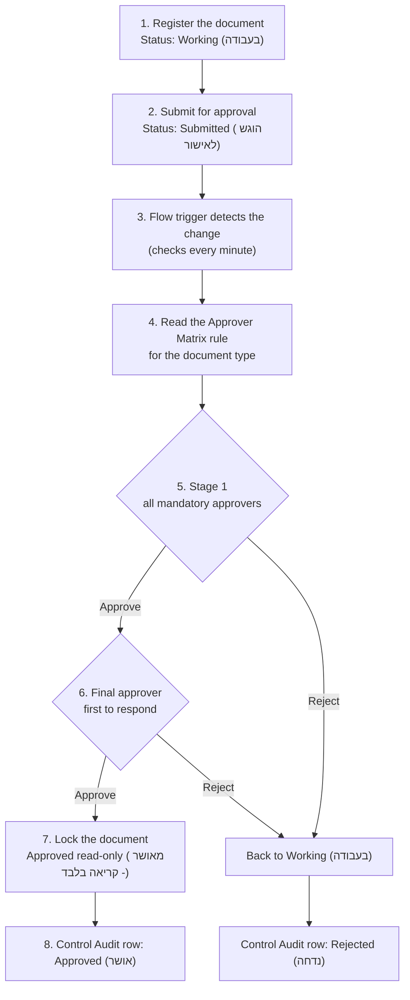

# 07 - Approval Flow (pilot)

How a document moves from submission to an approved, read-only record in the pilot flow **DC-P1 Pilot Approval** (`scripts/New-DmsPilotFlowPackage.ps1`).

Presentation: [`presentations/DMS-Approval-Flow.pptx`](presentations/DMS-Approval-Flow.pptx) (Hebrew, 3 editable slides: title, swimlane flow, principles).

## Flow

## Swimlanes

| Lane | Steps |
| --- | --- |
| Document owner | 1 Register the document, 2 Submit for approval |
| SharePoint | Document Register (the record), Approver Matrix (who approves), Control Audit (every decision) |
| Power Automate | 3 Detect the submission, 4 Find the rule, 7 Lock the document or return it to Working |
| Mandatory approvers | 5 Stage 1 approval (everyone must approve), in Teams Approvals and by email |
| Final approver | 6 Final approval (first to respond), in Teams Approvals and by email |

## Principles

1. **Who approves** comes from the Approver Matrix, per document type. A name changed in the matrix applies from the next submission, without changing the flow.
2. **How people approve**: an approval request in Teams (Approvals app) and by email, with a link to the document record. One rejection returns the document to its owner.
3. **What is kept**: every decision is written to the Control Audit list with the time, the actor and the responses. The file stays on the file server and never passes through Power Automate.

## Related

- Full design of the approval cycle: [04 - Power Automate](04-Power-Automate.md), DC-03, DC-04 and DC-05.
- Building the flows with Copilot: [06 - Copilot Prompts](06-Copilot-Prompts.md).
