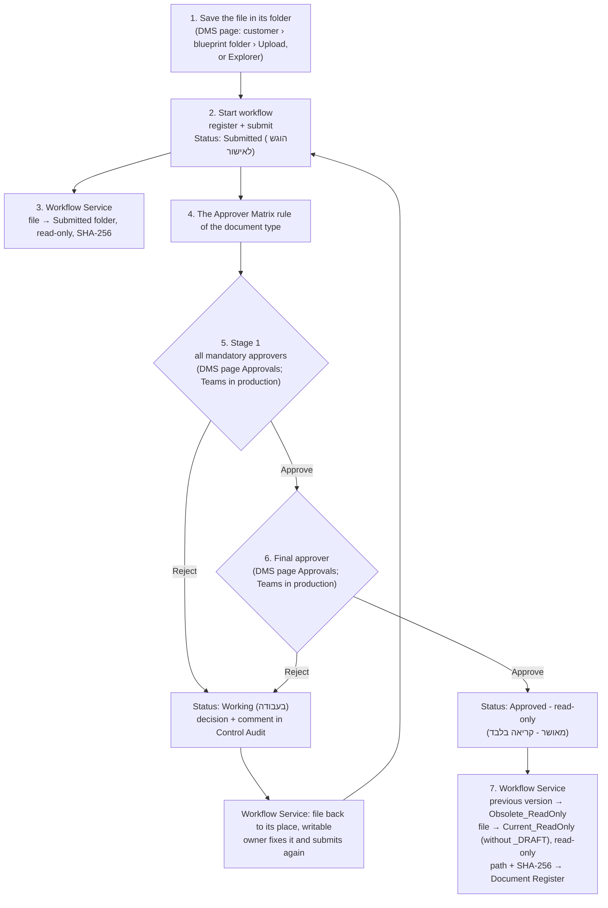

# 08 - Pilot Process (end to end)

How a document goes from a file on the file server to an approved, read-only version, through the **RH - Documents Management System** page (`webapi/`), the approval flow **DC-P1** and the Workflow Service. It also covers the pilot test with one super user.

Related: [07 - Approval Flow](07-Approval-Flow.md) (the flow inside Power Automate), [`webapi/README.md`](../webapi/README.md) (the page: install, AD checks, AI Insights), [01 §4](01-Architecture-and-Data-Model.md) (the repository tree).

## 1. The parts

| Part | Where | What it does |
| --- | --- | --- |
| File server (`$Root`) | On-prem, blueprint Appendix A tree | Holds every file. NTFS permissions (AD groups) decide who sees what |
| DMS page | Company network, `https://<server>/dms/dms-page?lang=EN` (or `HE`), linked from RH Navigator | Browse by customer and the blueprint tree, save files, start the workflow, see status, find files, AI Insights |
| Explorer right-click | Each PC (`scripts/Install-DmsExplorerMenu.ps1`) | **Start workflow** on a file opens the page with the file filled in |
| Document Register | SharePoint `DocumentControl` site | One record per controlled document: ID, type, status, owner, paths, SHA-256 |
| Approver Matrix | SharePoint | Who approves each document type (mandatory approvers, final approver) |
| Approvals | DMS page (pilot) or DC-P1 in Power Automate (production) | Stage 1 mandatory approvers, stage 2 final approver from the Approver Matrix; sets the result and writes each decision to Control Audit |
| Workflow Service | DMS server (inside the page service in the pilot) | Moves the file to match its status, sets read-only, writes the path and SHA-256 back |
| Control Audit | SharePoint | Every event: registered, submitted, approved/rejected, file moved |
| AI Insights | RH on-prem LLM (`chat.ai.rh-global.com`) | Answers about a document, finds files the user is allowed to see |

## 2. The process


**Pilot: everything on the DMS page.** In the pilot the approvers approve or reject on the page itself (**Approvals**), by the same rules as DC-P1: the Approver Matrix rule of the document type, stage 1 = every mandatory approver, stage 2 = the final approver, one rejection returns the document. DC-P1 is turned **Off** for the pilot, so nothing is sent to Teams twice. In production the same steps run with DC-P1 and Teams (`DMS_APPROVALS=flow`).



### Step by step (the user)

1. **Find the place.** On the DMS page choose the customer. The **Location** lists follow the blueprint tree: choosing a folder fills the next list with its subfolders, only the ones AD allows (for example Customer_A › Projects › PRJ-101 › Test engineering › Test reports). Or use **What are you saving?**: pick the kind (Quotation, RFQ, SOW, ECO, test report...) and, when needed, the project, and the page goes to the right folder. Or open **🧭 Path finder** (folder toolbar or menu): build the path level by level from the blueprint tree, including blueprint folders that do not exist yet (marked *new*), then **Go there**, **Create and go**, **Upload here** or **Copy path**.
2. **Save the file.** **Upload file** saves it from the PC into the open folder. The user can also create folders, rename and delete (to the recycle folder) where they have write permission.
3. **Start workflow.** On the file: **Start workflow** → document type, area, control mode → **Register and submit**. From Explorer: right-click → **Start workflow** opens the same form.
4. **Follow it.** **My workflows** shows every document the user registered or submitted: counts per status, days waiting, the last decision with the approver's comment, and the full history.
5. **After a rejection** the status is **Rejected - back to you** and the file is back where it was saved, writable. Fix it and click **Submit for approval** again.
6. **After the approval** the file is in `Current_ReadOnly` next to where it was saved, read-only, with status **Approved (read-only)**. The previous approved version is in `Obsolete_ReadOnly`.

### A new revision of an approved document

On the approved file (in `Current_ReadOnly`, or in **My workflows**) click **⟳ New revision**. Choose **a copy of the approved revision** (opened in Excel/Word to edit) or **a file from my computer**, and optionally **Submit for approval now**. The draft is saved next to the document as `<name>_Rev02_DRAFT.<ext>` (the number follows the current revision: Rev01 → Rev02 → Rev03), on the **same record**, so the Document ID and the full history stay together. While the new revision is in work, the approved Rev01 stays in `Current_ReadOnly`. When Rev02 is approved, Rev01 moves to `Obsolete_ReadOnly` and `..._Rev02.<ext>` becomes the current version.

### A new document from a file on the PC

In any folder you may write to: **＋ New document** → choose the file → type, area, control mode → **Register and submit** (or Register only). The file is saved in the folder and registered in one step.

### Sharing an approved document with a customer

On the approved file (or in My workflows): **✉ Share with customer** → the customer's email → Share. The approved revision is copied to the **Large File Exchange** site (`TemporaryUploads/Outbound/<DocumentId>_RevNN/`) and SharePoint sends the customer a personal invitation, view only (B2B guest, no anonymous link). The DocumentControl site is never shared. Only approved documents can be shared, by the owner or a super user; each share is a Control Audit row (שינוי הרשאות). The Exchange site must allow external guests: SharePoint admin center › Sites › LargeFileExchange-TEST › Sharing = *New and existing guests*, and if allowed guest domains are set, add the customer's domain (for the test, gmail.com).

### What the approver does

**Pilot (on the page):** the header shows **Approvals** with the number waiting. The list shows each document, its owner, type, stage, who already approved and how long it waits, with Open, Download and ✦ AI to read it, and **Approve** (optional comment) / **Reject** (comment required). Stage 1: every mandatory approver must approve. Stage 2: the final approver. One rejection ends the cycle; the comment goes back to the owner in My workflows. A DMS super user can decide any stage (recorded as "super user") and see **All pending approvals**.

**Production (DC-P1):** the same decisions arrive in **Teams (Approvals)** and by email.

**Notifications (pilot):** at each step the page writes a row to the **DMS Notifications** list and the flow **DC-P2 Pilot Notifications** sends it by **email and Teams** (Flow bot), with a link that opens the page on Approvals or My workflows:

| When | Who is told |
| --- | --- |
| Submitted (or resubmitted) | The stage 1 (mandatory) approvers |
| Stage 1 complete | The final approver |
| Approved | The owner |
| Rejected | The owner, with the comment |
| Withdrawn | The approvers who were waiting |

Set up once: `.\scripts\New-DmsNotifyFlowPackage.ps1 -TenantName rhisrael -ClientId $C -DocControlSiteAlias DocumentControl-TEST` (creates the list and `scripts\out\DC-P2-PilotNotifications.zip`), then **My flows > Import > Import Package (Legacy)**, pick the SharePoint, Office 365 Outlook and Teams connections, and turn DC-P2 **On**. Every notification stays in the list (who was told what and when).

Every decision is a Control Audit row (Approved / Rejected, stage, comment, who, when), and My workflows shows for each submitted document **who it is waiting for**.

### Where the file is at each status

| Status (Document Register) | File location | Read-only |
| --- | --- | --- |
| Working (בעבודה) | Where the user saved it (e.g. `...\Commercial\Quotations\Quote.xlsx`) | No |
| Submitted (הוגש לאישור) | `...\Quotations\Submitted\Quote.xlsx` | Yes |
| Approved - read-only (מאושר - קריאה בלבד) | `...\Quotations\Current_ReadOnly\Quote.xlsx` | Yes |
| Previous approved version | `...\Quotations\Obsolete_ReadOnly\...` | Yes |
| Deleted from the page | `$Root\04_Workflow_System\Recycle\<date>\<user>\...` | - |

The Workflow Service never updates a record while it is Submitted, so the approval flow is not triggered twice. Every move is written to Control Audit (source: Workflow Service).

## 3. Finding files

- **Search** (top of the page): All, Customer, Project, Document ID, File, or **✦ Smart**.
- **AI Insights → Find a file**: describe the file in your own words ("the latest FCT report of the CRU4 project"). The AI turns it into a search plan; the service searches only the folders the user may read; the AI ranks the matches and says why. The AI sees only names the user is allowed to see, never decides on access.
- **AI Insights → Ask** (or ✦ AI on a file): summary, key requirements, risks, dates. The file goes only to the on-prem LLM, after the AD read check.

## 4. Roles and permissions

| Role | Who | Can |
| --- | --- | --- |
| User | Every employee (Windows login, no login screen) | See and work only where AD allows; save, rename, delete in folders they may write; register and submit their documents; My workflows |
| Approver | From the Approver Matrix, per document type | Approve or reject on the page (pilot) or in Teams (production) |
| DMS super user | `DMS_ADMINS` (pilot: roneno@rh.co.il) | Submit any document, decide any approval stage, **All workflows**, **All pending approvals**, Move files now |
| IT / Document Control | `GG_DMS_ITAdmins`, `GG_DMS_DocumentControl` | Approver Matrix, restore from the recycle folder, the service and its logs |

Always protected: the company structure (`$Root`, `02_Customers`, each customer folder); the DMS workflow folders `Submitted`, `Current_ReadOnly`, `Obsolete_ReadOnly` and `Working` (read only on the page: nothing can be added, renamed or deleted in them, and a folder that holds them cannot be renamed or deleted); and every registered document (cannot be renamed or deleted from the page).

## 5. Pilot test (one super user runs it all)

roneno@rh.co.il runs the whole process from the DMS page: saving, submitting, approving both stages, following and finding.

Prerequisites: the tree on `$Root` (`scripts/New-DmsFileServerTree.ps1`), the `DocumentControl-TEST` site, `$Root` and `$C` set in pwsh, `git pull` in `C:\dms`. In Power Automate turn **DC-P1 Pilot Approval Off** for the pilot (approvals are on the page).

**Set up** (once):

```powershell
cd C:\dms\scripts; .\Set-DmsTestApprover.ps1 -TenantName rhisrael -DocControlSiteAlias DocumentControl-TEST -ClientId $C -Approver roneno@rh.co.il
```

```powershell
cd C:\dms\webapi; .\Start-DmsPlayground.ps1 -Root $Root -Live -ClientId $C
```

Sign in as roneno@rh.co.il when the browser asks. His name shows with ★ (super user). The green banner says **Pilot - live ... Approvals on this page**.

**Validation scenario** (in this order; tick each line)

Before you start: DC-P1 **Off**, DC-P2 **On** (notifications), roneno is the approver of every type (`Set-DmsTestApprover.ps1`), the Exchange site allows external guests (see "Sharing" below). Keep three windows open: the DMS page, Explorer on `$Root`, and Outlook/Teams of roneno@rh.co.il. Use a new test file, e.g. `Test Quote_Rev1.xlsx`.

| # | Do | Check |
| --- | --- | --- |
| **A** | **Find the place** | |
| 1 | Choose Customer_A, follow the Location lists to Commercial › Quotations | Each list offers only subfolders, blueprint order, English/Hebrew names; Thumbs.db never shows |
| 2 | 🧭 **Path finder**: Customers › Customer_A › Projects › a project › Test engineering › Test reports | Missing blueprint folders show *(new)*; **Create and go** creates and opens it |
| 3 | **What are you saving?** → Quotation → **Take me there** | Quotations opens with the upload window |
| **B** | **New document and submission** | |
| 4 | **＋ New document** → choose `Test Quote_Rev1.xlsx` → type הצעת מחיר → **Register and submit** | Status **Submitted**, a new DMS-xxxxx; **Approvals** badge = 1 |
| 5 | Outlook and Teams of roneno | "DMS-xxxxx ... waiting for your approval" (email + Flow bot), link opens the page on **Approvals** |
| 6 | SharePoint: Document Register and Control Audit | A record (status הוגש לאישור, DraftRevision 01); audit rows נוצר + הוגש; a row in DMS Notifications |
| 7 | Wait 1 minute (or My workflows → **Move files now**) | The file is in `Quotations\Submitted`, read-only; the report line says MoveToSubmitted |
| **C** | **Rejection** | |
| 8 | **Approvals** → **Reject** with comment "fix the price" | Status **Rejected - back to you** with the comment; notification to the owner |
| 9 | Move files now; open the file in Excel, change it, save | The file is back in Quotations, writable |
| 10 | My workflows → **Submit for approval** | Submitted again; new notification to the approvers; the approval starts again at stage 1 |
| **D** | **Approval** | |
| 11 | **Approvals** → **Approve** (stage 1) | The row moves to **2 - final approver**; notification to the final approver |
| 12 | **Approve** (stage 2) | Status **Approved (read-only)**; notification to the owner; audit rows Stage 1 + Stage 2 |
| 13 | Move files now | The file is in `Quotations\Current_ReadOnly`, read-only; the record has CurrentUncPath, CurrentSHA256, CurrentRevision 01 |
| **E** | **Protection** | |
| 14 | Try to rename/delete the approved file, `Current_ReadOnly`, `Quotations` and `Customer_A` | All refused, with the reason (controlled document / managed by the DMS / company structure) |
| 15 | In `Current_ReadOnly`: no Upload, New folder, Rename, Delete buttons | 🔒 "Managed by the DMS" banner |
| 16 | New folder "Temp", rename it "Temp2", delete it | Works; it is in `04_Workflow_System\Recycle\<date>\roneno`; four FS rows in Control Audit |
| **F** | **New revision** | |
| 17 | On the approved file: **⟳ New revision** → a copy of the approved revision | `Test Quote_Rev02_DRAFT.xlsx` next to the document, opens in Excel; status Working, Rev01 still in `Current_ReadOnly` |
| 18 | Edit, save, **Submit for approval**, approve both stages, Move files now | `Current_ReadOnly\Test Quote_Rev02.xlsx`; Rev01 in `Obsolete_ReadOnly`; CurrentRevision 02 |
| 19 | **New revision** again → **a file from my computer** + Submit now | `..._Rev03_DRAFT` from the chosen file, submitted |
| 20 | My workflows → **Withdraw** it | Back to Working, Withdrawn in the history, notification to the waiting approvers |
| **G** | **Share with the customer** | |
| 21 | On the approved file: **✉ Share with customer** → `edssrom@gmail.com` | "Invitation sent"; the copy is in the Exchange site `TemporaryUploads/Outbound/DMS-xxxxx_Rev02/`; a Shared row in the history |
| 22 | Gmail edssrom@gmail.com | An invitation from SharePoint; opening it asks for a one-time code (or a Microsoft account) and shows the file **view only** |
| 23 | Try to share a document that is not approved | Refused: only approved documents |
| **H** | **Finding and follow-up** | |
| 24 | Search **✦ Smart** "test quote"; AI Insights → Find a file "latest test quote of Customer_A" | The document is suggested with its status; Go to folder opens it |
| 25 | My workflows (counts, history) and **All workflows** | Every step above is in the history, with who and when |
| 26 | Explorer right-click on a file → **Start workflow** (`Install-DmsExplorerMenu.ps1 -AppUrl 'http://localhost:8080/dms/dms-page?lang=EN'`) | The page opens with the Start workflow form for that file |

**After the pilot**: restore the real approvers with the command `Set-DmsTestApprover.ps1` printed (`-Restore <backup file>`), and stop the page with Ctrl+C.

## 6. What is kept in SharePoint

All the metadata is in SharePoint (`DocumentControl` site), which Microsoft 365 backs up and versions (list item version history, recycle bin):

- **Document Register**: one record per document: ID, title, type, area, control mode, owner, status, current and draft revision, working and current paths, SHA-256 of the current version, last approval time.
- **Control Audit**: every event, with who and when: registered, submitted, each approval or rejection (stage and comment), withdrawn, new revision, every file move by the Workflow Service, and every change made on the page in the repository (upload, new folder, rename, delete; CorrelationId `FS`).
- **Approver Matrix**: who approves each document type.
- **DMS Notifications**: every email/Teams notification of the pilot (recipients, subject, message, link).

The files themselves stay on the file server (backed up by the file server backup, Veeam). Deleted items go to `04_Workflow_System\Recycle\<date>\<user>`.

## 7. Known limits of the pilot

- With approvals in Teams (DC-P1, production) the pending approvers are not recorded until a decision is made; on the page (pilot) My workflows shows who each document waits for. A step in DC-P1 that writes the pending approvers to Control Audit would close this for production.
- Do not run DC-P1 and page approvals at the same time: with DC-P1 On, the same document would also be sent to Teams.
- On a PC the page runs as the signed-in user, without AD checks. The AD checks (Windows sign-in through IIS) apply when it is installed on the server (`webapi/README.md`).
