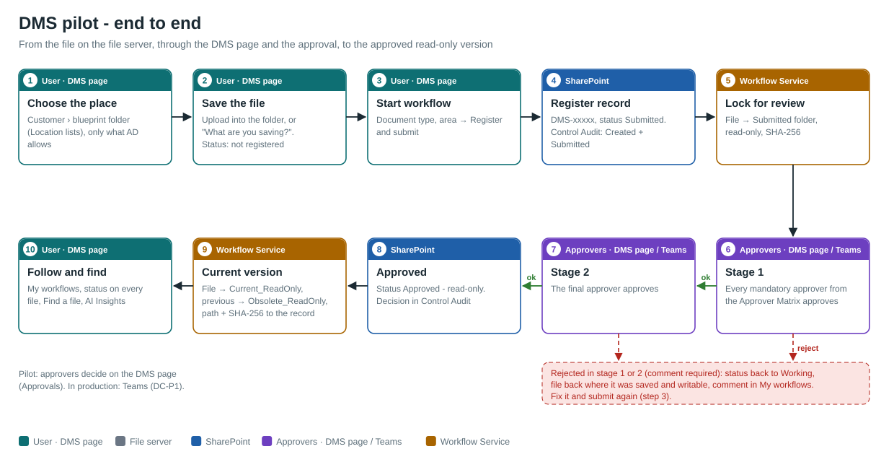
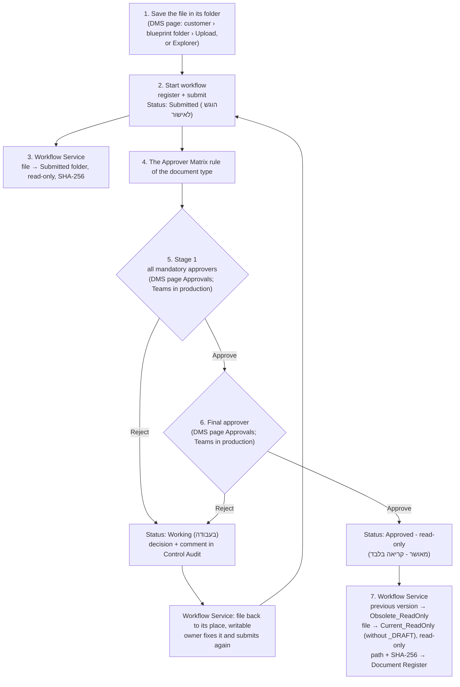

# 08 - Pilot Process (end to end)

How a document goes from a file on the file server to an approved, read-only version, through the **RH - Documents Management System** page (`webapi/`), the approval flow **DC-P1** and the Workflow Service. It also covers the pilot test with one super user.

Related: [07 - Approval Flow](07-Approval-Flow.md) (the flow inside Power Automate), [`webapi/README.md`](../webapi/README.md) (the page: install, AD checks, AI Insights), [01 §4](01-Architecture-and-Data-Model.md) (the repository tree).

## 1. The parts

| Part | Where | What it does |
| --- | --- | --- |
| File server (`$Root`) | On-prem, blueprint Appendix A tree | Holds every file. NTFS permissions (AD groups) decide who sees what |
| DMS page | Company network, `https://<server>/dms/dms-page?lang=EN` (or `HE`), linked from RH Navigator | Browse by customer and the blueprint tree, save files, start the workflow, see status, find files, AI Insights |
| Explorer right-click | Each PC (`scripts/Install-DmsExplorerMenu.ps1`) | **Start workflow** on a file opens the page with the file filled in |
| Document Register | SharePoint `DocumentControl` site | One record per controlled document: ID, type, status, owner, paths, SHA-256 |
| Approver Matrix | SharePoint | Who approves each document type (mandatory approvers, final approver) |
| Approvals | DMS page (pilot) or DC-P1 in Power Automate (production) | Stage 1 mandatory approvers, stage 2 final approver from the Approver Matrix; sets the result and writes each decision to Control Audit |
| Workflow Service | DMS server (inside the page service in the pilot) | Moves the file to match its status, sets read-only, writes the path and SHA-256 back |
| Control Audit | SharePoint | Every event: registered, submitted, approved/rejected, file moved |
| AI Insights | RH on-prem LLM (`chat.ai.rh-global.com`) | Answers about a document, finds files the user is allowed to see |

## 2. The process



**Pilot: everything on the DMS page.** In the pilot the approvers approve or reject on the page itself (**Approvals**), by the same rules as DC-P1: the Approver Matrix rule of the document type, stage 1 = every mandatory approver, stage 2 = the final approver, one rejection returns the document. DC-P1 is turned **Off** for the pilot, so nothing is sent to Teams twice. In production the same steps run with DC-P1 and Teams (`DMS_APPROVALS=flow`).



### Step by step (the user)

1. **Find the place.** On the DMS page choose the customer. The **Location** lists follow the blueprint tree: choosing a folder fills the next list with its subfolders, only the ones AD allows (for example Customer_A › Projects › PRJ-101 › Test engineering › Test reports). Or use **What are you saving?**: pick the kind (Quotation, RFQ, SOW, ECO, test report...) and, when needed, the project, and the page goes to the right folder.
2. **Save the file.** **Upload file** saves it from the PC into the open folder. The user can also create folders, rename and delete (to the recycle folder) where they have write permission.
3. **Start workflow.** On the file: **Start workflow** → document type, area, control mode → **Register and submit**. From Explorer: right-click → **Start workflow** opens the same form.
4. **Follow it.** **My workflows** shows every document the user registered or submitted: counts per status, days waiting, the last decision with the approver's comment, and the full history.
5. **After a rejection** the status is **Rejected - back to you** and the file is back where it was saved, writable. Fix it and click **Submit for approval** again.
6. **After the approval** the file is in `Current_ReadOnly` next to where it was saved, read-only, with status **Approved (read-only)**. The previous approved version is in `Obsolete_ReadOnly`.

### What the approver does

**Pilot (on the page):** the header shows **Approvals** with the number waiting. The list shows each document, its owner, type, stage, who already approved and how long it waits, with Open, Download and ✦ AI to read it, and **Approve** (optional comment) / **Reject** (comment required). Stage 1: every mandatory approver must approve. Stage 2: the final approver. One rejection ends the cycle; the comment goes back to the owner in My workflows. A DMS super user can decide any stage (recorded as "super user") and see **All pending approvals**.

**Production (DC-P1):** the same decisions arrive in **Teams (Approvals)** and by email.

Every decision is a Control Audit row (Approved / Rejected, stage, comment, who, when), and My workflows shows for each submitted document **who it is waiting for**.

### Where the file is at each status

| Status (Document Register) | File location | Read-only |
| --- | --- | --- |
| Working (בעבודה) | Where the user saved it (e.g. `...\Commercial\Quotations\Quote.xlsx`) | No |
| Submitted (הוגש לאישור) | `...\Quotations\Submitted\Quote.xlsx` | Yes |
| Approved - read-only (מאושר - קריאה בלבד) | `...\Quotations\Current_ReadOnly\Quote.xlsx` | Yes |
| Previous approved version | `...\Quotations\Obsolete_ReadOnly\...` | Yes |
| Deleted from the page | `$Root\04_Workflow_System\Recycle\<date>\<user>\...` | - |

The Workflow Service never updates a record while it is Submitted, so the approval flow is not triggered twice. Every move is written to Control Audit (source: Workflow Service).

## 3. Finding files

- **Search** (top of the page): All, Customer, Project, Document ID, File, or **✦ Smart**.
- **AI Insights → Find a file**: describe the file in your own words ("the latest FCT report of the CRU4 project"). The AI turns it into a search plan; the service searches only the folders the user may read; the AI ranks the matches and says why. The AI sees only names the user is allowed to see, never decides on access.
- **AI Insights → Ask** (or ✦ AI on a file): summary, key requirements, risks, dates. The file goes only to the on-prem LLM, after the AD read check.

## 4. Roles and permissions

| Role | Who | Can |
| --- | --- | --- |
| User | Every employee (Windows login, no login screen) | See and work only where AD allows; save, rename, delete in folders they may write; register and submit their documents; My workflows |
| Approver | From the Approver Matrix, per document type | Approve or reject on the page (pilot) or in Teams (production) |
| DMS super user | `DMS_ADMINS` (pilot: roneno@rh.co.il) | Submit any document, decide any approval stage, **All workflows**, **All pending approvals**, Move files now |
| IT / Document Control | `GG_DMS_ITAdmins`, `GG_DMS_DocumentControl` | Approver Matrix, restore from the recycle folder, the service and its logs |

Always protected: the company structure (`$Root`, `02_Customers`, each customer folder), the workflow folders (managed by the DMS only), and every registered document (cannot be renamed or deleted from the page).

## 5. Pilot test (one super user runs it all)

roneno@rh.co.il runs the whole process from the DMS page: saving, submitting, approving both stages, following and finding.

Prerequisites: the tree on `$Root` (`scripts/New-DmsFileServerTree.ps1`), the `DocumentControl-TEST` site, `$Root` and `$C` set in pwsh, `git pull` in `C:\dms`. In Power Automate turn **DC-P1 Pilot Approval Off** for the pilot (approvals are on the page).

**Set up** (once):

```powershell
cd C:\dms\scripts; .\Set-DmsTestApprover.ps1 -TenantName rhisrael -DocControlSiteAlias DocumentControl-TEST -ClientId $C -Approver roneno@rh.co.il
```

```powershell
cd C:\dms\webapi; .\Start-DmsPlayground.ps1 -Root $Root -Live -ClientId $C
```

Sign in as roneno@rh.co.il when the browser asks. His name shows with ★ (super user). The green banner says **Pilot - live ... Approvals on this page**.

**Test cases**

| # | Do | Expected |
| --- | --- | --- |
| 1 | Choose Customer_A, follow the Location lists down to Commercial › Quotations | Each list offers only the subfolders, in blueprint order, with English/Hebrew names |
| 2 | **What are you saving?** → Quotation → **Take me there** | Commercial › Quotations opens with the upload window |
| 3 | Upload a quote file | The file is listed, status **Not registered** |
| 4 | **Start workflow** → type הצעת מחיר → **Register and submit** | Status **Submitted**, a new DMS-xxxxx ID; a record in the Document Register; rows Created + Submitted in Control Audit; **Approvals** shows 1 |
| 5 | Wait 1 minute (or My workflows → **Move files now**) | The file is in `Quotations\Submitted`, read-only |
| 6 | **Approvals** → Approve (stage 1), then Approve again (stage 2 - final approver) | After stage 1 the row shows stage 2; after stage 2 status **Approved (read-only)**; two Approved rows (Stage 1, Stage 2) in Control Audit |
| 7 | **Move files now** | The file is in `Quotations\Current_ReadOnly`, read-only; CurrentUncPath and CurrentSHA256 on the record |
| 8 | Repeat 3-4 with another file, then **Reject** in Approvals with a comment | My workflows: **Rejected - back to you** with the comment; after Move files now the file is back in Quotations, writable |
| 9 | **Submit for approval** again, approve | Approved as in 6-7 |
| 10 | Upload a new version of the approved quote (same name) and approve it | The old version moves to `Obsolete_ReadOnly`, the new one is in `Current_ReadOnly` |
| 11 | Try to rename or delete an approved or submitted file, and a customer folder | Refused, with the reason |
| 12 | Create a folder, rename it, delete it | Works; the deleted folder is in `04_Workflow_System\Recycle` |
| 13 | Search **✦ Smart** "FCT quote", and AI Insights → Find a file | The quote is suggested with its status; Go to folder opens its folder |
| 14 | Right-click the file in Explorer → **Start workflow** (`Install-DmsExplorerMenu.ps1 -AppUrl 'http://localhost:8080/dms/dms-page?lang=EN'`) | The page opens with the Start workflow form for that file |
| 15 | My workflows → **All workflows** | Every workflow in the register, with the owner |

**After the pilot**: restore the real approvers with the command `Set-DmsTestApprover.ps1` printed (`-Restore <backup file>`), and stop the page with Ctrl+C.

## 6. Known limits of the pilot

- With approvals in Teams (DC-P1, production) the pending approvers are not recorded until a decision is made; on the page (pilot) My workflows shows who each document waits for. A step in DC-P1 that writes the pending approvers to Control Audit would close this for production.
- Do not run DC-P1 and page approvals at the same time: with DC-P1 On, the same document would also be sent to Teams.
- On a PC the page runs as the signed-in user, without AD checks. The AD checks (Windows sign-in through IIS) apply when it is installed on the server (`webapi/README.md`).
- Registering a new version of an approved document from the page creates a new record; a "new revision" action on the approved record is the next step.
