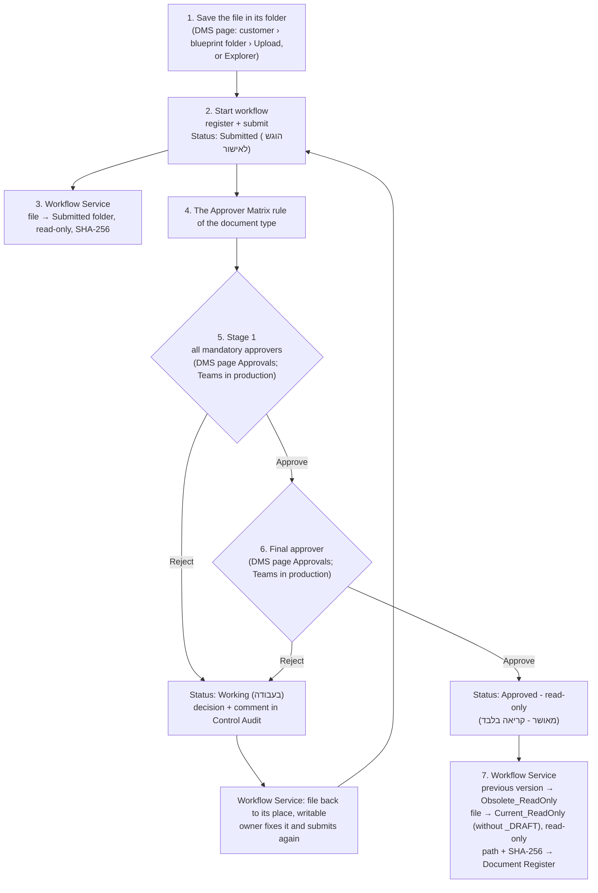

# 08 - Pilot Process (end to end)

How a document goes from a file on the file server to an approved, read-only version, through the **RH - Documents Management System** page (`webapi/`), the approval flow **DC-P1** and the Workflow Service. It also covers the pilot test with one super user.

Related: [07 - Approval Flow](07-Approval-Flow.md) (the flow inside Power Automate), [`webapi/README.md`](../webapi/README.md) (the page: install, AD checks, AI Insights), [01 §4](01-Architecture-and-Data-Model.md) (the repository tree).

## 1. The parts

| Part | Where | What it does |
| --- | --- | --- |
| File server (`$Root`) | On-prem, blueprint Appendix A tree | Holds every file. NTFS permissions (AD groups) decide who sees what |
| DMS page | Company network, `https://<server>/dms/dms-page?lang=EN` (or `HE`), linked from RH Navigator | Browse by customer and the blueprint tree, save files, start the workflow, see status, find files, AI Insights |
| Explorer right-click | Each PC (`scripts/Install-DmsExplorerMenu.ps1`) | **Start workflow** on a file opens the page with the file filled in |
| Document Register | SharePoint `DocumentControl` site | One record per controlled document: ID, type, status, owner, paths, SHA-256 |
| Approver Matrix | SharePoint | Who approves each document type (mandatory approvers, final approver) |
| Approvals | DMS page (pilot) or DC-P1 in Power Automate (production) | Stage 1 mandatory approvers, stage 2 final approver from the Approver Matrix; sets the result and writes each decision to Control Audit |
| Workflow Service | DMS server (inside the page service in the pilot) | Moves the file to match its status, sets read-only, writes the path and SHA-256 back |
| Control Audit | SharePoint | Every event: registered, submitted, approved/rejected, file moved |
| AI Insights | RH on-prem LLM (`chat.ai.rh-global.com`) | Answers about a document, finds files the user is allowed to see |

## 2. The process


**Pilot: everything on the DMS page.** In the pilot the approvers approve or reject on the page itself (**Approvals**), by the same rules as DC-P1: the Approver Matrix rule of the document type, stage 1 = every mandatory approver, stage 2 = the final approver. In stage 1 every approver answers (approve, or return with remarks); when all answered and someone returned it, the document goes back to the owner with everyone's remarks. DC-P1 is turned **Off** for the pilot, so nothing is sent to Teams twice. In production the same steps run with DC-P1 and Teams (`DMS_APPROVALS=flow`).



### Step by step (the user)

1. **Find the place.** On the DMS page choose the customer. The **Location** lists follow the blueprint tree: choosing a folder fills the next list with its subfolders, only the ones AD allows (for example Customer_A › Projects › PRJ-101 › Test engineering › Test reports). Or use **What are you saving?**: pick the kind (Quotation, RFQ, SOW, ECO, test report...) and, when needed, the project, and the page goes to the right folder. Or open **🧭 Path finder** (folder toolbar or menu): build the path level by level from the blueprint tree, including blueprint folders that do not exist yet (marked *new*), then **Go there**, **Create and go**, **Upload here** or **Copy path**.
2. **Save the file.** **Upload file** saves it from the PC into the open folder. The user can also create folders, rename and delete (to the recycle folder) where they have write permission.
3. **Start workflow.** On the file: **Start workflow**. Document type, area and control mode are preselected from the blueprint folder (✓ "blueprint folder"); change them if needed. The dialog shows who the **Approver Matrix** sends it to; or tick **Choose the approvers myself** and select people from the list of all RH Microsoft 365 users (filter, or type a name to search the whole company): all of them must approve, in one stage. Then **Register and submit**. From Explorer: right-click → **Start workflow** opens the same form.
   A document still in Working can be **renamed** (the register follows) or **deleted** (the file to the recycle folder, the record kept as Archived).
4. **Follow it.** **My workflows** shows every document the user registered or submitted: counts per status, days waiting, the last decision with the approver's comment, and the full history.
5. **After a rejection, or a withdraw** (My workflows → Withdraw), the status is **Rejected - back to you** / Working and the file is back where it was saved, at once and under its own name, writable. Fix it and click **Submit**: the dialog preselects the approvers chosen last time (keep, change, or untick for the Approver Matrix).
6. **After the approval** the file is in `Current_ReadOnly` next to where it was saved, read-only, with status **Approved (read-only)**. The previous approved version is in `Obsolete_ReadOnly`.

### A new revision of an approved document

On the approved file (in `Current_ReadOnly`, or in **My workflows**) click **⟳ New revision**. Choose **a copy of the approved revision** (opened in Excel/Word to edit) or **a file from my computer**, and optionally **Submit for approval now**. The draft is saved next to the document as `<name>_Rev02_DRAFT.<ext>` (the number follows the current revision: Rev01 → Rev02 → Rev03), on the **same record**, so the Document ID and the full history stay together. While the new revision is in work, the approved Rev01 stays in `Current_ReadOnly`. When Rev02 is approved, Rev01 moves to `Obsolete_ReadOnly` and `..._Rev02.<ext>` becomes the current version.

### A new document from a file on the PC

In any folder you may write to: **＋ New document** → choose the file → type, area, control mode → **Register and submit** (or Register only). The file is saved in the folder and registered in one step.

### Sharing an approved document with a customer

On the approved file (or in My workflows): **✉ Share with customer** → the customer's email → Share.
- **Customer:** a list of all the customer folders (`02_Customers\<Customer>`, names as is). The customer of the file's own folder is preselected (✓), and you can choose any other; a file outside the customer folders (e.g. a procedure) asks you to choose.
- **Where:** the approved files are copied straight into the customer folder on the **Large File Exchange** site, `TemporaryUploads/Outbound/<Customer>/` (no folder per file), and SharePoint sends the customer a personal invitation to that folder, view only (B2B guest, no anonymous link).
- **Many files:** tick more approved documents in the dialog (filter by name, ID or customer); they all go to the same folder. Every later share adds to it, so the customer sees all the files shared with them in one place.
- **Share log:** every share, by any user, appends a row to `02_Customers\<Customer>\Shared\DMS-Shared-Log.csv` on the file server (date, shared by, shared with, Document ID, title, revision, file, Exchange link, available until); expired shares append an *Expired* row. The Shared folder and the file are created if missing (`DMS_SHARED_LOG`, empty = off). The log is read only: read-only attribute, and its own Windows permissions (Read for users, so no edit, rename or delete; Modify only for the account the DMS runs under, which only appends). On the DMS page the whole customer **Shared** folder is read only: its files (the log and any file in it) can only be opened (view only, Office files), downloaded or have their path copied; no rename, delete, upload, new folder, new document or workflow, and the folder itself cannot be renamed or deleted. Opens in Excel (UTF-8, Hebrew shown correctly).
- **3 days:** each file stays on the Exchange site 3 days after its last share (`DMS_EX_DAYS`, 0 = never). Then the DMS (an hourly check) moves it to the Exchange site recycle bin; when the customer folder is left empty it is removed too, and with it the customer's access. Sharing the file again starts the 3 days over. Each removal is a Control Audit row (`Share expired after 3 days: ...`). If the folder is created again later, the OneDrive shortcut is pointed to the new folder.
- **OneDrive shortcut:** a shortcut **DMS_<Customer>** to that folder is added to your OneDrive, inside the folder **DMS Shortcuts** (created if missing; `DMS_EX_SHORTCUT_FOLDER`). If your OneDrive was never set up, the DMS requests its setup (a few minutes) and the shortcut is added on the next share; with the server sign-in (certificate) an admin sets it up instead (`Request-SPOPersonalSite -UserEmails <email>`). It needs the Microsoft Graph permission *Files.ReadWrite.All* on the Entra app (delegated, admin consent); the first time, a sign-in window may open on the DMS PC. If it cannot be created, the share still succeeds and the message says why. `DMS_EX_SHORTCUT=false` turns it off.

The DocumentControl site is never shared. Only approved documents can be shared, by the owner or a super user; each share is a Control Audit row (שינוי הרשאות). The Exchange site must allow external guests: SharePoint admin center › Sites › LargeFileExchange-TEST › Sharing = *New and existing guests*, and if allowed guest domains are set, add the customer's domain (for the test, gmail.com).

**Shared status:** in My workflows, under the status, "✉ Shared with: email (Rev NN, date) - until dd/mm/yyyy" lists every customer the document was shared with and when the file leaves the Exchange site ("expired" after that). The same is in History, in Control Audit, and on the Exchange site (the file → Manage access).

### What the approver does

**Remarks in the file:** while a document is in approval, the owner and the approvers can open the submitted file for editing (**✎ Open to edit (remarks)** in Approvals and in My workflows) and add comments or tracked changes in Word / Excel. Every approve or reject records the file's SHA-256 in Control Audit, so it is known exactly which content each decision was made on; on approval the file as it is then becomes the current revision. `DMS_SUBMITTED_EDITABLE=false` (and `-SubmittedEditable $false` for the workflow service script) locks the submitted file again.

**Pilot (on the page):** the header shows **Approvals** with the number waiting. The list shows each document, its owner, type, stage, who already approved and how long it waits, with Open, Download and ✦ AI to read it, and **Approve** (optional comment) / **Return with remarks** (remarks required). Stage 1: every mandatory approver answers; each can open the file (✎ Open to edit), add tracked changes and comments, and return it, and the list shows the remarks given so far. The cycle ends when all of them answered: all approved → stage 2 (the final approver); anyone returned it → back to the owner (Returned with remarks) with all the remarks together. The owner reviews and accepts the changes in the file and clicks **Submit** again (the same approvers are preselected). In stage 2 a return goes back to the owner at once. A DMS super user can decide any stage (recorded as "super user") and see **All pending approvals**.

**Delegate:** in Approvals, **⇄ Delegate** passes the approval to someone else (from the RH users, with a note) for **3 working days** (Sunday to Thursday; `DMS_DELEGATION_DAYS`, `DMS_WEEKEND`). The delegate sees it in Approvals and is notified; after the last day it returns to the original approver. A super user can delegate for any waiting approver (**On behalf of**). Each delegation is a row in the **Delegations** list (delegator, delegate, from, to, reason, who) and a Control Audit row `Delegated: a -> b (until dd/mm/yyyy)`.

A document type with no Approver Matrix rule goes to the DMS super users.

**Production (DC-P1):** the same decisions arrive in **Teams (Approvals)** and by email.

**Notifications (pilot):** at each step the page writes a row to the **DMS Notifications** list and the flow **DC-P2 Pilot Notifications** sends it by **email and Teams** (Flow bot), only to the people in the row (never the whole company), in the **language the user chose on the page** (Hebrew right to left, or English), with a link that opens the page in that language on Approvals or My workflows:

| When | Who is told |
| --- | --- |
| Submitted (or resubmitted) | The stage 1 (mandatory) approvers |
| Stage 1 complete | The final approver |
| Approved | The owner |
| Rejected | The owner, with the comment |
| Withdrawn | The approvers who were waiting |
| Delegated | The delegate |

Set up once: `.\scripts\New-DmsNotifyFlowPackage.ps1 -TenantName rhisrael -ClientId $C -DocControlSiteAlias DocumentControl-TEST` (creates the list and `scripts\out\DC-P2-PilotNotifications.zip`), then **My flows > Import > Import Package (Legacy)**, pick the SharePoint, Office 365 Outlook and Teams connections (Standard connectors, no Premium license), Import, then **Open flow → Turn on** (imported flows start Off; keep one copy only). Turn **DC-P1 Off** while approvals are on the page. Every notification stays in the list (who was told what and when). Check it from the page: ⋮ → **🩺 SharePoint check** shows whether notifications are on, the last ones with their recipients and result, and **✉ Send me a test notification**; a row written but no email or Teams means the flow (On? run history?).

Every decision is a Control Audit row (Approved / Rejected, stage, comment, who, when), and My workflows shows for each submitted document **who it is waiting for**.

### Where the file is at each status

| Status (Document Register) | File location | Read-only |
| --- | --- | --- |
| Working (בעבודה) | Where the user saved it (e.g. `...\Commercial\Quotations\Quote.xlsx`) | No |
| Submitted (הוגש לאישור) | `...\Quotations\Submitted\Quote.xlsx` | Yes |
| Approved - read-only (מאושר - קריאה בלבד) | `...\Quotations\Current_ReadOnly\Quote.xlsx` | Yes |
| Previous approved version | `...\Quotations\Obsolete_ReadOnly\...` | Yes |
| Deleted from the page | `$Root\04_Workflow_System\Recycle\<date>\<user>\...` | - |

The Workflow Service never updates a record while it is Submitted, so the approval flow is not triggered twice. Every move is written to Control Audit (source: Workflow Service).

## 3. Finding files

- **Search** (one box, top of the page, the whole repository): while typing it suggests customers, folders, documents (Document ID and status) and file names; ↓↑ + Enter opens the folder, Enter alone shows all results. Several words in any order; an exact Document ID first. Smart suggestions describe the file in your own words ("the latest FCT report of the CRU4 project"): the RH AI makes the search plan and ranks the matches, seeing only names the user may see.
- **AI Insights → Ask**: questions to the RH AI chat, also about a file (the file is attached after the AD read check, only to the on-prem AI). **📚 QMS**: questions to the QMS knowledge (RAG), with the procedures as sources.
- **🔗 Copy link** copies the path of a folder or a file; **Open** opens Office files from the server (long paths through their short 8.3 form).

## 4. Roles and permissions

| Role | Who | Can |
| --- | --- | --- |
| User | Every employee (Windows login, no login screen) | See and work only where AD allows; save, rename, delete in folders they may write; register and submit their documents; My workflows |
| Approver | From the Approver Matrix, per document type | Approve or reject on the page (pilot) or in Teams (production) |
| DMS super user | `DMS_ADMINS` (pilot: roneno@rh.co.il) | Submit any document, decide any approval stage, delegate for any approver, **All workflows**, **All pending approvals** (the default view), Move files now, DMS First loading, 🩺 SharePoint check |
| IT / Document Control | `GG_DMS_ITAdmins`, `GG_DMS_DocumentControl` | Approver Matrix, restore from the recycle folder, the service and its logs |

The blueprint is the **skeleton**; everything inside it is **content** (files and folders with their own names, at any depth). Always protected: the skeleton (`$Root`, `02_Customers`, each customer and project folder, and every blueprint folder such as `Commercial`, `Quotations`, `01_General\Quality_System` - they cannot be renamed or deleted from the page, their content can); the DMS workflow folders `Submitted`, `Current_ReadOnly`, `Obsolete_ReadOnly` and `Working` (read only on the page: nothing can be added, renamed or deleted in them, and a folder that holds them cannot be renamed or deleted); and every registered document (cannot be renamed or deleted from the page).

## 5. Pilot test (one super user runs it all)

roneno@rh.co.il runs the whole process from the DMS page: saving, submitting, approving both stages, following and finding.

Prerequisites: the tree on `$Root` (`scripts/New-DmsFileServerTree.ps1`), the `DocumentControl-TEST` site, `$Root` and `$C` set in pwsh, `git pull` in `C:\dms`. In Power Automate turn **DC-P1 Pilot Approval Off** for the pilot (approvals are on the page).

**Set up** (once):

```powershell
cd C:\dms\scripts; .\Set-DmsTestApprover.ps1 -TenantName rhisrael -DocControlSiteAlias DocumentControl-TEST -ClientId $C -Approver roneno@rh.co.il
```

```powershell
cd C:\dms\webapi; .\Start-DmsPlayground.ps1 -Root $Root -Live -ClientId $C
```

Sign in as roneno@rh.co.il when the browser asks. His name shows with ★ (super user). The green banner says **Pilot - live ... Approvals on this page**.

**Validation scenario** (in this order; tick each line)

Before you start: DC-P1 **Off**, DC-P2 **On** (notifications), roneno is the approver of every type (`Set-DmsTestApprover.ps1`), the Exchange site allows external guests (see "Sharing" below). Keep three windows open: the DMS page, Explorer on `$Root`, and Outlook/Teams of roneno@rh.co.il. Use a new test file, e.g. `Test Quote_Rev1.xlsx`.

| # | Do | Check |
| --- | --- | --- |
| **A** | **Find the place** | |
| 1 | Choose Customer_A, follow the Location lists to Commercial › Quotations | Each list offers only subfolders, blueprint order, English/Hebrew names; Thumbs.db never shows |
| 2 | 🧭 **Path finder**: Customers › Customer_A › Projects › a project › Test engineering › Test reports | Missing blueprint folders show *(new)*; **Create and go** creates and opens it |
| 3 | **What are you saving?** → Quotation → **Take me there** | Quotations opens with the upload window |
| **B** | **New document and submission** | |
| 4 | **＋ New document** → choose `Test Quote_Rev1.xlsx` → type הצעת מחיר → **Register and submit** | Status **Submitted**, a new DMS-xxxxx; **Approvals** badge = 1 |
| 5 | Outlook and Teams of roneno | "DMS-xxxxx ... waiting for your approval" (email + Flow bot), link opens the page on **Approvals** |
| 6 | SharePoint: Document Register and Control Audit | A record (status הוגש לאישור, DraftRevision 01); audit rows נוצר + הוגש; a row in DMS Notifications |
| 7 | Wait 1 minute (or My workflows → **Move files now**) | The file is in `Quotations\Submitted`, read-only; the report line says MoveToSubmitted |
| **C** | **Rejection** | |
| 8 | **Approvals** → **Reject** with comment "fix the price" | Status **Rejected - back to you** with the comment; notification to the owner |
| 9 | Move files now; open the file in Excel, change it, save | The file is back in Quotations, writable |
| 10 | My workflows → **Submit for approval** | Submitted again; new notification to the approvers; the approval starts again at stage 1 |
| **D** | **Approval** | |
| 11 | **Approvals** → **Approve** (stage 1) | The row moves to **2 - final approver**; notification to the final approver |
| 12 | **Approve** (stage 2) | Status **Approved (read-only)**; notification to the owner; audit rows Stage 1 + Stage 2 |
| 13 | Move files now | The file is in `Quotations\Current_ReadOnly`, read-only; the record has CurrentUncPath, CurrentSHA256, CurrentRevision 01 |
| **E** | **Protection** | |
| 14 | Try to rename/delete the approved file, `Current_ReadOnly`, `Quotations` and `Customer_A` | All refused, with the reason (controlled document / managed by the DMS / company structure) |
| 15 | In `Current_ReadOnly`: no Upload, New folder, Rename, Delete buttons | 🔒 "Managed by the DMS" banner |
| 16 | New folder "Temp", rename it "Temp2", delete it | Works; it is in `04_Workflow_System\Recycle\<date>\roneno`; four FS rows in Control Audit |
| **F** | **New revision** | |
| 17 | On the approved file: **⟳ New revision** → a copy of the approved revision | `Test Quote_Rev02_DRAFT.xlsx` next to the document, opens in Excel; status Working, Rev01 still in `Current_ReadOnly` |
| 18 | Edit, save, **Submit for approval**, approve both stages, Move files now | `Current_ReadOnly\Test Quote_Rev02.xlsx`; Rev01 in `Obsolete_ReadOnly`; CurrentRevision 02 |
| 19 | **New revision** again → **a file from my computer** + Submit now | `..._Rev03_DRAFT` from the chosen file, submitted |
| 20 | My workflows → **Withdraw** it | Back to Working, Withdrawn in the history, notification to the waiting approvers |
| **G** | **Share with the customer** | |
| 21 | On the approved file: **✉ Share with customer** → `edssrom@gmail.com` | "Invitation sent"; the copy is in the Exchange site `TemporaryUploads/Outbound/DMS-xxxxx_Rev02/`; a Shared row in the history |
| 22 | Gmail edssrom@gmail.com | An invitation from SharePoint; opening it asks for a one-time code (or a Microsoft account) and shows the file **view only** |
| 23 | Try to share a document that is not approved | Refused: only approved documents |
| **H** | **Finding and follow-up** | |
| 24 | Type "test quote" in the search box (suggestions while typing), then Enter; AI Insights → Ask, and 📚 QMS "נהלי שינוע" | The document is suggested with its status and opens its folder; the answers appear in the panel (QMS with its sources) |
| 25 | My workflows (counts, history) and **All workflows** | Every step above is in the history, with who and when |
| 26 | Explorer right-click on a file → **Start workflow** (`Install-DmsExplorerMenu.ps1 -AppUrl 'http://localhost:8080/dms/dms-page?lang=EN'`) | The page opens with the Start workflow form for that file |

**After the pilot**: restore the real approvers with the command `Set-DmsTestApprover.ps1` printed (`-Restore <backup file>`), and stop the page with Ctrl+C.

## 5a. DMS First loading (documents approved in the old repository)

For documents that were already approved in the old, unmanaged repository. A DMS super user runs it from the page: **⋮ menu → ⇪ DMS First loading**.

1. **Source**: the old repository folder (e.g. `\\OLD-SERVER\Share\Customer_A\CRU4`). **Target**: the folder under `$Root` (🧭 Path finder helps), e.g. `02_Customers\Customer_A\Projects\PRJ-101_CRU4\Customer_Source\Specifications`. Choose the document type, area and control mode for the batch.
2. **Dry run** first (checked by default): it lists every file with what will happen, and for File Linker whether the old path is registered. Nothing changes.
3. Run it for real (uncheck Dry run). For every file, with the same subfolders under the target:
   - the file is taken from the target (when you already moved it there manually) or copied from the source ("Copy files that are still only in the source");
   - it is moved into `<its folder>\Current_ReadOnly\`, set read-only, and its SHA-256 is computed;
   - it is registered as **Approved** in the Document Register, revision from the file name (`_Rev3` → 03, else 01), with Control Audit rows "DMS First loading from <source path>";
   - **File Linker**: WebAPI#1 checks whether the **source** path is registered; if it is, WebAPI#2 replaces it with the new `Current_ReadOnly` path (and a Control Audit row records it).
4. The result table and a CSV report in `$Root\04_Workflow_System\FirstLoading\` list each file: target, Document ID, revision, SHA-256, result, File Linker. Next to it, a **full trace log** (`FirstLoading_<date-time>.log`, written line by line so it is complete even if a run stops) records the run's parameters, every step of every file (found in the target or copied from the source, moved, read-only, SHA-256, Document ID, audit rows, File Linker WebAPI#1/#2 answers), every error with its details, and a summary. Dry runs write `..._dry-run.log` / `.csv`. Running it again skips what was already loaded.

From then on these documents behave like any approved document: New revision, Share with customer, search, history.

File Linker is configured in the service `.env` (`DMS_FL_CHECK_URL`, `DMS_FL_UPDATE_URL`, `DMS_FL_UPDATE_BODY`, `DMS_FL_REGISTERED_FIELD`, `DMS_FL_AUTH`); see `webapi/.env.example`.

## 6. What is kept in SharePoint

All the metadata is in SharePoint (`DocumentControl` site), which Microsoft 365 backs up and versions (list item version history, recycle bin):

- **Document Register**: one record per document: ID, title, type, area, control mode, owner, status, current and draft revision, working and current paths, SHA-256 of the current version, last approval time.
- **Control Audit**: every event, with who and when: registered, submitted, each approval or rejection (stage and comment), withdrawn, new revision, every file move by the Workflow Service, and every change made on the page in the repository (upload, new folder, rename, delete; CorrelationId `FS`), and each DMS First loading run: Created + Approved (+ File Linker) per loaded file, one row per failed file, and one summary row per run (also dry runs; CorrelationId `FIRST-LOAD-<stamp>`) with the full trace `.log` and the `.csv` report attached.
  - The details text is in the **Event Details** column. On a site provisioned before this change, add it (and the attachments) to the view once: `Set-PnPView -List "Lists/ControlAudit" -Identity "All Events" -Fields "EventUtc","CorrelationId","AuditEventType","FromStatus","ToStatus","ActorEmail","EventSource","EventDetails","Attachments"`
  - AI Insights: every question, QMS (RAG) question and file search (CorrelationId `AI`): who, the file asked about, the question, and the answer or the suggested files.
  - Not in SharePoint: the file service run summaries (service log only).
- **Approver Matrix**: who approves each document type. When starting a workflow the user may instead choose the approvers ("Choose the approvers myself", people from the directory): all of them must approve, in one stage, and the choice is kept in the Control Audit 'submitted' row (`Approvers (chosen): ...`).
- **DMS Notifications**: every email/Teams notification of the pilot (recipients, subject, message, link).
- **Delegations**: every delegated approval (Approvals ← Delegate): delegator, delegate, date, reason (document and note), who did it. Control Audit also gets a 'שינוי הרשאות' row `Delegated: a -> b`.
- **Approval Decisions** (החלטות מאשרים): one row per decision on the page (Approved / Rejected) and per delegation (Delegated): workflow, document, revision, approver, role (Mandatory / Final), stage, comment, time, and Delegated from when a delegate decided. Decisions made before this version are not back-filled.

The files themselves stay on the file server (backed up by the file server backup, Veeam). Deleted items go to `04_Workflow_System\Recycle\<date>\<user>`.

## 7. Known limits of the pilot

- With approvals in Teams (DC-P1, production) the pending approvers are not recorded until a decision is made; on the page (pilot) My workflows shows who each document waits for. A step in DC-P1 that writes the pending approvers to Control Audit would close this for production.
- Do not run DC-P1 and page approvals at the same time: with DC-P1 On, the same document would also be sent to Teams.
- On a PC the page runs as the signed-in user, without AD checks. The AD checks (Windows sign-in through IIS) apply when it is installed on the server (`webapi/README.md`).
- The **Delegations** list keeps the status Active after a delegation's last day; the DMS stops applying it on that day.
- **Open** for long paths needs 8.3 short names on the file server volume (`fsutil 8dot3name query E:`).
- Notifications written while the DC-P2 flow was Off are not sent later.

## 8. Useful links

Import `docs/RH-DMS-Bookmarks.html` into Chrome (Ctrl+Shift+O → ⋮ → Import bookmarks): the DMS page, the DocumentControl-TEST lists (Document Register, Control Audit, Approver Matrix, DMS Notifications), site permissions, Large File Exchange, Power Automate, Entra app registrations, the RH AI and QMS, and this repository.

**First loading modes** (⋮ › DMS First loading, super users): **DMS approval (simulated)** runs, for each file, the same steps and records as a normal approval: registered in Working (Created) → submitted with the approver chosen (Submitted, `Approvers (chosen): dms_approval@rh.co.il`) → MoveToSubmitted (file service row, SHA-256) → approved by the approver (Approved in Control Audit with the file SHA-256, and a row in Approval Decisions) → PromoteToCurrent (`Current_ReadOnly`, read-only; CurrentRevision, CurrentSHA256 and LastApprovedUtc in the Document Register). The approver is `DMS_FIRST_LOAD_APPROVER` (default `dms_approval@rh.co.il`) or the one typed for the run; no notifications are sent. **Save only** acts as a formal approval by the DMS itself: each file goes to `Current_ReadOnly` in its folder (same subfolders), read-only, with a Control Audit row (Approved, actor `DMS`, file SHA-256); it is registered in the Document Register (status Approved, control mode Collaboration - "שיתופי ללא תהליך", owner = who saved it) and has no workflow (save the file again to replace it, which adds another Control Audit row). "New revision" on such a file starts the normal workflow: the record changes to the folder's control mode (Workflow Required) and from then on it is a controlled document. "Save file (no workflow)" on the page does the same for one file. Trace them in SharePoint: Document Register filtered by ControlMode = Collaboration, or Control Audit filtered by Actor = DMS. The owner can share them with a customer like any approved document. Both modes move the File Linker links to the new path; run a dry run first.
